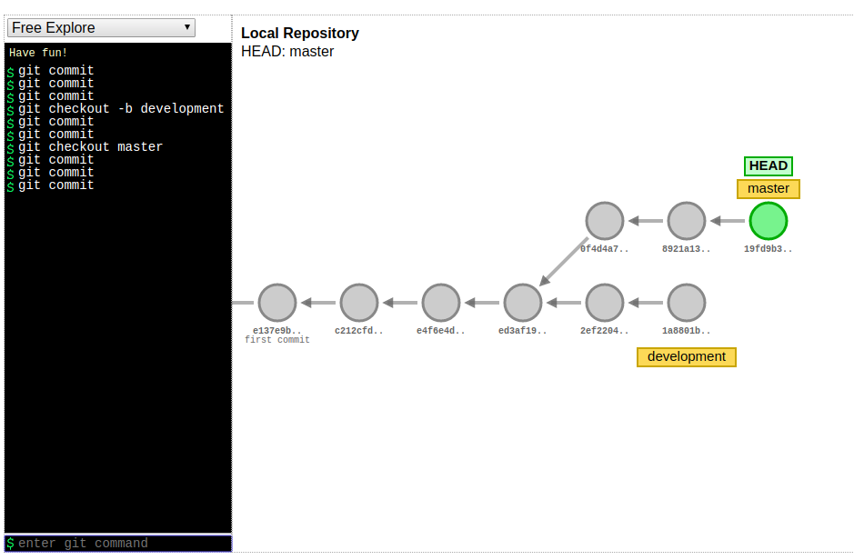
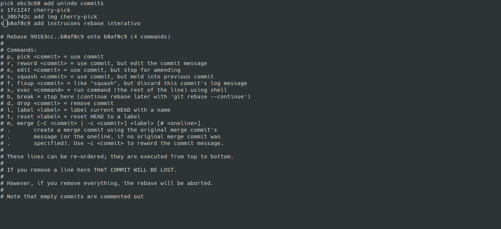
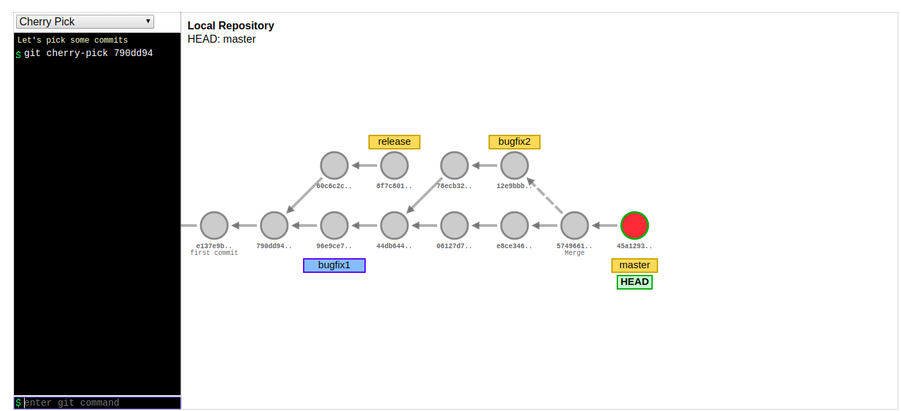

# GitTips
:octocat:

> is _indicated_ for those who already have a knowledge base on the **GIT versioning** tool

#### Branchs

> branch master, it is recommended to leave only the code finalized, tested and ready for production.

##### Nomenclature suggestion

###### Features

* feature_78364-overdraft
* feature/overdraft

###### Bugfix

* fix_78364-overdraft
* fix/overdeaft


#### Git flow | Branchs


> https://git-school.github.io/visualizing-git/ - test and play

Example:



___


#### About commit

> If you're in charge of English and your team too, then check it out, commit everything in English.

> If you do not understand very well. Please commit in Portuguese.

- Commit

  * It was not marked to commit, the add was not done, run command: ```git checkout -- arquivo```

  * Undo a change that was marked to commit, done the add, run command: ```git reset HEAD arquivo```

  * Undo a change that has been marked to commit and has been committed!

    ​		run command: ```git log```

    ​		to see the hash of the commit, then, run command: ```git revert 49ghg434hghg434398sdhs```

    this will create a new commit, undoing the revert

- Stash
  * to save modifications to a temporary location, run command: ```git stash```
  * list saved stashs, run command: ```git stash list```
  * resume a specific saved stash, run command: ```git stash apply INDICE_DO_STASH```
  * delete stash, run command: ```git drop stash```
  * apply and remove stash, run command: ```git stash pop```
  
- Uniting commits

  * Let's rebase, run command: ```git rebase -i HEAD~3```
  * Will open the default editor of your PC, in my case the VI, select the commit to be the pick, add s in the rest.

  Here's an example from the following image:

  


* Getting a specific commit (otherwise branch)  and bringing to current branch

  * run command: ```git cherry-pick hash_do_commit```

  

Example:



#### Git bisect tutorial

###### First:

run command: ```git log --oneline```

###### Second:

run command: ```git bisect start```

###### Third:

indicate which state/commit demand is bad/bugged/with incorrect change, for example take the **HEAD**:

run command: ```git bisect bad HEAD```

###### Fourth:

indicate which state/commit demand is correct/bug-free, with correct change, for example take the **ANY HASH**:

run command: ```git bisect good c1273bf8```

> Within these committed indicated he goes searching until I determine that: YES, this is it!

###### Fifth:

ending the search

run command: ```git bisect reset```

###### Sixth:

by hashing the chosen commit and then revert with this hash

run command: ```git show hash_commit```

##### Time travel - commit

Let's start with the, run command: ```git log --oneline```

See that we have several commits and we have a single hash for each commit, to change your application to a specific commit.

run command: ```git checkout HASH_DO_COMMIT```

> Feel relaxed when you give a ```git log```

> https://devhints.io/git-log

#### Finding who/author modified such file

###### To find who modified a file:

run command: ```git blame nome_do_arquivo```

#### Interesting tools for working with git

* git kraken
* source tree
* git cola

___


Suggestion? 

Please open an issue <3

